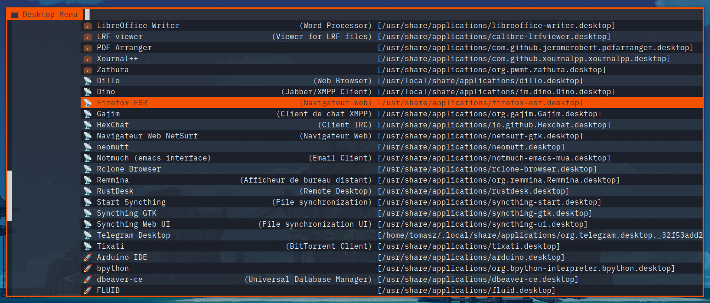

# bemenu-desktop-menu

A script for [bemenu](https://github.com/Cloudef/bemenu) to run your desktop applications using dex.



The preview uses my wrapper for bemenu: [bemenu-orange-wrapper](https://github.com/tkapias/bemenu-orange-wrapper).

## Dependencies

- [bemenu >= 0.6](https://github.com/Cloudef/bemenu)
- [Nerd Fonts (Symbols Only)](https://github.com/ryanoasis/nerd-fonts/releases/latest)
- [dex](https://github.com/jceb/dex)
- Bash >= 5
- setsid
- GNU awk, sed, xargs

### Optional

- [bemenu-orange-wrapper](https://github.com/tkapias/bemenu-orange-wrapper)

## Installation

### Dependencies

- Debian example with [bemenu-orange-wrapper](https://github.com/tkapias/bemenu-orange-wrapper):

1. Follow [bemenu-orange-wrapper instructions](https://github.com/tkapias/bemenu-orange-wrapper?tab=readme-ov-file#installation).

2. Next:

``` bash
# GNU awk, sed, xargs, setsid, dex
sudo apt install gawk sed findutils util-linux dex
```

### bemenu-desktop-menu

```bash
git clone --depth 1 https://github.com/tkapias/bemenu-desktop-menu.git bemenu-desktop-menu
cd bemenu-desktop-menu
chmod +x bemenu-desktop-menu.bash
```

  - The script uses the default locations to find the desktop entries:
    - `"$HOME/.local/share/applications"`
    - `"/usr/local/share/applications"`
    - `"/usr/share/applications"`
    If your system has different locations, add/modify them in the `desktop_path` array.

- Optional: Symlink to a directory in your user's path:

```bash
ln -s $PWD/bemenu-desktop-menu.bash $HOME/.local/bin/bemenu-desktop-menu
```

## Features

- Entries sorted by Main Categories.
- Main Categories icon using Emojis.
- Display entry Name and Generic Name localized if available.
- Display the entry file location in brackets.
- Cache the list and generate only if the count or modification date of entries changed.
- Respect Hidden & NoDisplay features.
- Run the application forked using setsid.
- Run the application using also dex to respect XDG.

## Usage

Just launch bemenu-desktop-menu, optionally filter the entries and select one to launch the application.

### Integrations

- Binding exemple for bemenu-desktop-menu in i3wm:

```i3wm
bindsym $mod+d exec --no-startup-id "bemenu-desktop-menu"
```

